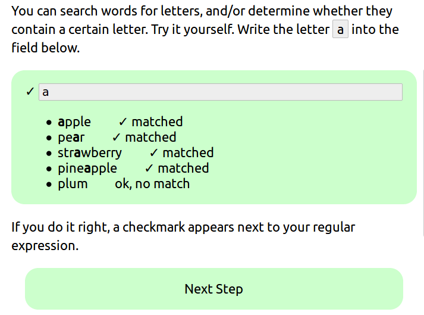

Regex-Tutorial
==============

[][gitter]

This is the source code for the [Regular Expressions Interactive Tutorial][site].
You can [download the tutorial][download].

Contribute
---------

Please use the tutorial.
If you have something to add or find a mistake, there is a link on each page to edit and improve the HTML file.
Then you can make a [pull request][pr].
If you have any questions or like to get in touch, you can [chat on gitter][gitter] or ping @niccokunzmann.

Translate
-------

Do you want to translate the tutorial into your own language? Great!
To do that, start by creating translations of the strings in [localization.json](https://github.com/CoderDojoPotsdam/regex-tutorial/blob/master/_data/localization.json).
Then you can create a folder in the root directory for your language and start translating!
When you have translated the first file, make sure to link to it in the [index file](https://github.com/CoderDojoPotsdam/regex-tutorial/blob/master/index.html).

Setup
-----

There are two ways to run this website, either by downloading Jekyll on your computer or by using GitHub Pages.

### Install Jekyll

1. Launch a terminal and run `gem install jekyll` to install Jekyll
2. Then run `jekyll serve --trace` in your forked repository to run Jekyll from there.
3. Type in `localhost:4000` to visit the website.
You can read more about installing Jekyll [here](https://jekyllrb.com/docs/installation/).

### Github Pages
1. [Fork](https://github.com/CoderDojoPotsdam/regex-tutorial/fork)
2. Go to your settings at https://github.com/YOUR_USERNAME/regex-tutorial/settings, you can make a live view of your code.
   

Further Reading
------------------------
- This tutorial is inspired by [Daniel Fett's tutorial on regular expressions][fett1].

License
------

 
Regex-Tutorial by Nicco Kunzmann  is licensed under a <a rel="license" href="http://creativecommons.org/licenses/by-sa/4.0/">Creative Commons Attribution-ShareAlike 4.0 International License.</a>.

Images in the [img](https://github.com/CoderDojoPotsdam/regex-tutorial/tree/master/img) folder are under a separate license.

[site]: https://coderdojopotsdam.github.io/regex-tutorial
[fett1]: https://www.danielfett.de/de/tutorials/tutorial-regulare-ausdrucke/
[pr]: https://github.com/CoderDojoPotsdam/regex-tutorial/compare
[download]: https://niccokunzmann.github.io/download_latest/regex-tutorial.zip
[gitter]: https://gitter.im/CoderDojoPotsdam/regex-tutorial?utm_source=badge&utm_medium=badge&utm_campaign=pr-badge&utm_content=badge
